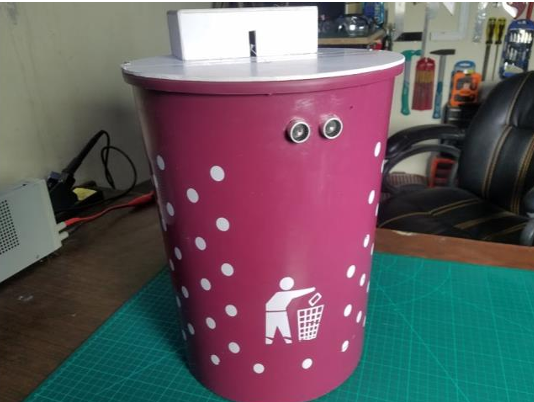

# 🗑️ Smart Dustbin using Arduino Uno

A contactless IoT-based smart dustbin system that opens automatically when a user’s hand is detected using an ultrasonic sensor and closes after a few seconds. Built using **Arduino Uno**, **Ultrasonic Sensor (HC-SR04)**, and **Servo Motor**.

---

## 📸 Project Prototype

---

## 🔧 Components Used

| Component               | Quantity |
|------------------------|----------|
| Arduino Uno            | 1        |
| Ultrasonic Sensor (HC-SR04) | 1    |
| Servo Motor            | 1        |
| Breadboard             | 1        |
| Jumper Wires           | 1 set    |
| Power Supply           | 1        |

---

## ⚙️ How It Works

1. **Hand detected** by ultrasonic sensor.
2. **Arduino Uno** receives the signal.
3. **Servo motor** opens the lid.
4. After a delay, the **lid closes** automatically.

---

## 🧠 Learning Outcomes

- Interfacing sensors with Arduino.
- Writing control logic for automation.
- Understanding basic IoT systems.
- Building hygienic tech for real-world use.

---

## 📄 Project Report

You can find the detailed project report [here](ProjectReportFormatfinalpdf.pdf).

---

## 📊 Block Diagram

---

## ✅ Output

 

---

